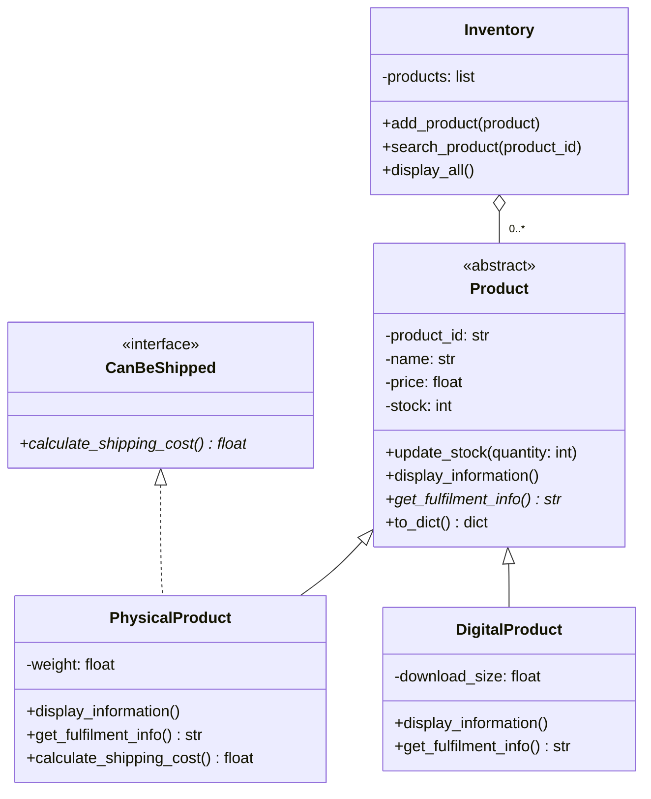

# Inventory Management System Class Diagram

```mermaid
classDiagram
    class Product {
        <<abstract>>
        -product_id: str
        -name: str
        -price: float
        -stock: int
        +update_stock(quantity: int)
        +display_information()
        +get_fulfilment_info() str*
        +to_dict() dict
    }

    class PhysicalProduct {
        -weight: float
        +display_information()
        +get_fulfilment_info() str
        +calculate_shipping_cost() float
    }

    class DigitalProduct {
        -download_size: float
        +display_information()
        +get_fulfilment_info() str
    }

    class CanBeShipped {
        <<interface>>
        +calculate_shipping_cost() float*
    }

    class Inventory {
        -products: list
        +add_product(product)
        +search_product(product_id)
        +display_all()
    }

    Product <|-- PhysicalProduct
    Product <|-- DigitalProduct
    CanBeShipped <|.. PhysicalProduct
    Inventory o-- "0..*" Product
```
